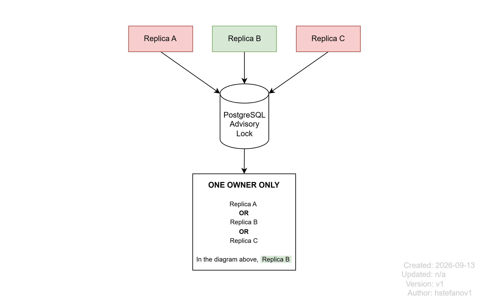
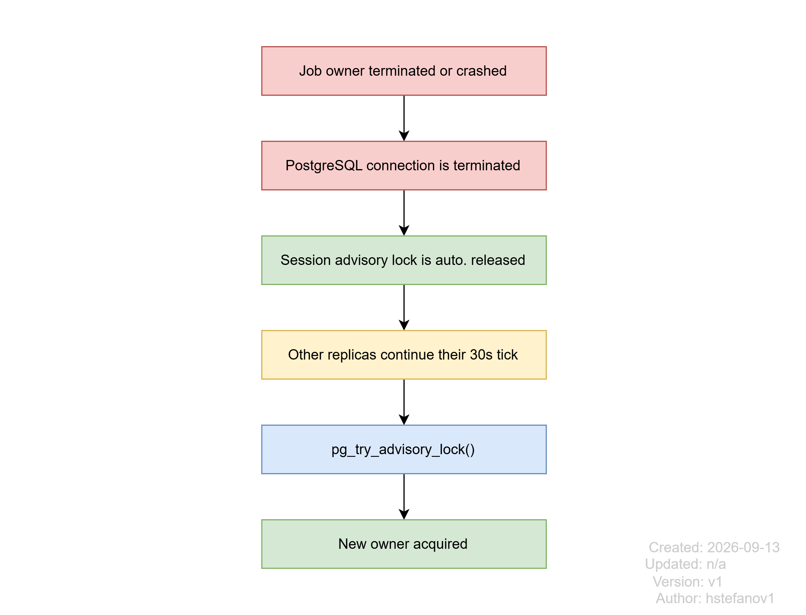

# Final Decision

*Date: 2026-09-13 | Author: hstefanov1*

## Summary

- Deactivation strategy: **batched fetch + entity-managed update loop**
- Lock type: **session** (until unlock or disconnect)
- Lock holder: **exclusive** (one holder)
- Acquire mode: **non-blocking** (try and return immediately)

**Multiple replicas competing for a single advisory lock, but only one owner at a time:**

## Leader Election Behavior

Every replica must periodically try to acquire the scheduler lock. Whoever owns it runs the
scheduler. If that replica dies, the next replica eventually acquires the lock.

**Recovery workflow when the lock-owning replica crashes or shuts down:**

